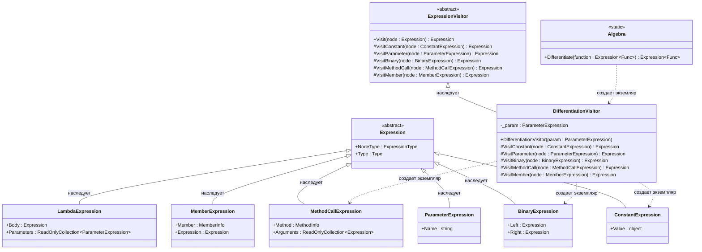

```mermaid
classDiagram
    class Expression {
        <<abstract>>
        +NodeType : ExpressionType
        +Type : Type
    }

    class ConstantExpression {
        +Value : object
    }

    class ParameterExpression {
        +Name : string
    }

    class BinaryExpression {
        +Left : Expression
        +Right : Expression
    }

    class MethodCallExpression {
        +Method : MethodInfo
        +Arguments : ReadOnlyCollection~Expression~
    }

    class MemberExpression {
        +Member : MemberInfo
        +Expression : Expression
    }

    class LambdaExpression {
        +Body : Expression
        +Parameters : ReadOnlyCollection~ParameterExpression~
    }

    Expression <|-- ConstantExpression : наследует
    Expression <|-- ParameterExpression : наследует
    Expression <|-- BinaryExpression : наследует
    Expression <|-- MethodCallExpression : наследует
    Expression <|-- MemberExpression : наследует
    Expression <|-- LambdaExpression : наследует

    class ExpressionVisitor {
        <<abstract>>
        +Visit(node : Expression) Expression
        #VisitConstant(node : ConstantExpression) Expression
        #VisitParameter(node : ParameterExpression) Expression
        #VisitBinary(node : BinaryExpression) Expression
        #VisitMethodCall(node : MethodCallExpression) Expression
        #VisitMember(node : MemberExpression) Expression
    }

    class Algebra {
        <<static>>
        +Differentiate(function : Expression~Func~) Expression~Func~
    }

    class DifferentiationVisitor {
        -_param : ParameterExpression
        +DifferentiationVisitor(param : ParameterExpression)
        #VisitConstant(node : ConstantExpression) Expression
        #VisitParameter(node : ParameterExpression) Expression
        #VisitBinary(node : BinaryExpression) Expression
        #VisitMethodCall(node : MethodCallExpression) Expression
        #VisitMember(node : MemberExpression) Expression
    }

    ExpressionVisitor <|-- DifferentiationVisitor : наследует
    Algebra ..> DifferentiationVisitor : создает экземляр
    DifferentiationVisitor ..> ConstantExpression : создает экземпляр
    DifferentiationVisitor ..> BinaryExpression : создает экземпляр
    DifferentiationVisitor ..> MethodCallExpression : создает экземпляр
```
