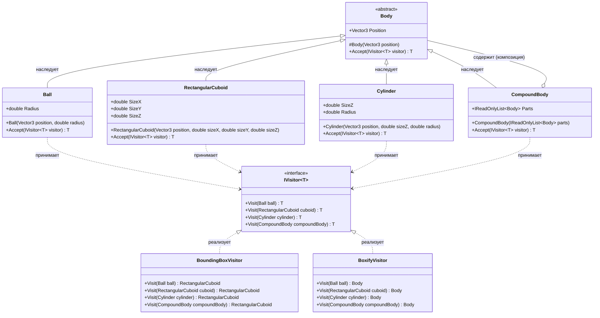

```mermaid
classDiagram
    class Body {
        <<abstract>>
        +Vector3 Position
        #Body(Vector3 position)
        +Accept(IVisitor~T~ visitor) T
    }

    class Ball {
        +double Radius
        +Ball(Vector3 position, double radius)
        +Accept(IVisitor~T~ visitor) T
    }

    class RectangularCuboid {
        +double SizeX
        +double SizeY
        +double SizeZ
        +RectangularCuboid(Vector3 position, double sizeX, double sizeY, double sizeZ)
        +Accept(IVisitor~T~ visitor) T
    }

    class Cylinder {
        +double SizeZ
        +double Radius
        +Cylinder(Vector3 position, double sizeZ, double radius)
        +Accept(IVisitor~T~ visitor) T
    }

    class CompoundBody {
        +IReadOnlyList~Body~ Parts
        +CompoundBody(IReadOnlyList~Body~ parts)
        +Accept(IVisitor~T~ visitor) T
    }

    class IVisitor~T~ {
        <<interface>>
        +Visit(Ball ball) T
        +Visit(RectangularCuboid cuboid) T
        +Visit(Cylinder cylinder) T
        +Visit(CompoundBody compoundBody) T
    }

    class BoundingBoxVisitor {
        +Visit(Ball ball) RectangularCuboid
        +Visit(RectangularCuboid cuboid) RectangularCuboid
        +Visit(Cylinder cylinder) RectangularCuboid
        +Visit(CompoundBody compoundBody) RectangularCuboid
    }

    class BoxifyVisitor {
        +Visit(Ball ball) Body
        +Visit(RectangularCuboid cuboid) Body
        +Visit(Cylinder cylinder) Body
        +Visit(CompoundBody compoundBody) Body
    }

    Body <|-- Ball : наследует
    Body <|-- RectangularCuboid : наследует
    Body <|-- Cylinder : наследует
    Body <|-- CompoundBody : наследует

    CompoundBody o-- Body : содержит (композиция)

    IVisitor~T~ <|.. BoundingBoxVisitor : реализует
    IVisitor~T~ <|.. BoxifyVisitor : реализует

    Ball ..> IVisitor~T~ : принимает
    RectangularCuboid ..> IVisitor~T~ : принимает
    Cylinder ..> IVisitor~T~ : принимает
    CompoundBody ..> IVisitor~T~ : принимает
```
