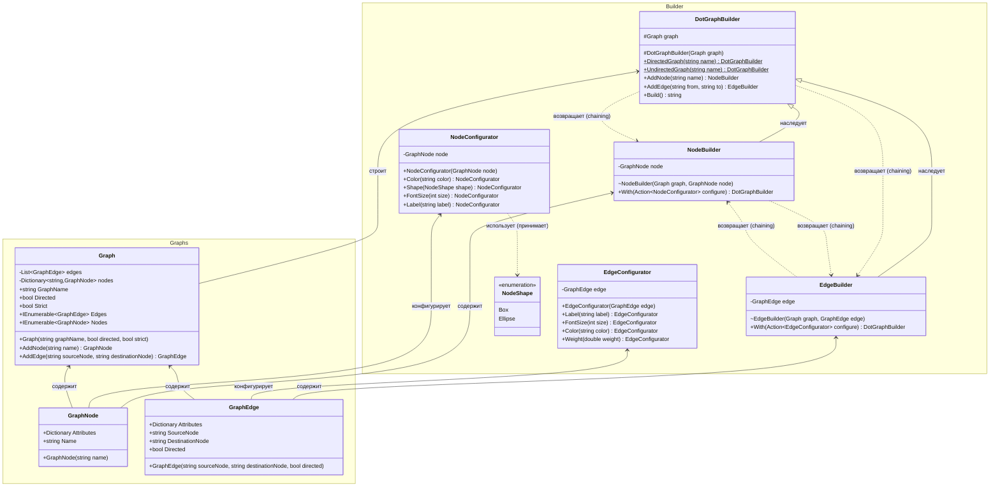

```mermaid
classDiagram
    namespace Builder {
        class DotGraphBuilder {
            #Graph graph
            #DotGraphBuilder(Graph graph)
            +DirectedGraph(string name)$ DotGraphBuilder
            +UndirectedGraph(string name)$ DotGraphBuilder
            +AddNode(string name) NodeBuilder
            +AddEdge(string from, string to) EdgeBuilder
            +Build() string
        }

        class NodeBuilder {
            -GraphNode node
            ~NodeBuilder(Graph graph, GraphNode node)
            +With(Action~NodeConfigurator~ configure) DotGraphBuilder
        }

        class EdgeBuilder {
            -GraphEdge edge
            ~EdgeBuilder(Graph graph, GraphEdge edge)
            +With(Action~EdgeConfigurator~ configure) DotGraphBuilder
        }

        class NodeConfigurator {
            -GraphNode node
            +NodeConfigurator(GraphNode node)
            +Color(string color) NodeConfigurator
            +Shape(NodeShape shape) NodeConfigurator
            +FontSize(int size) NodeConfigurator
            +Label(string label) NodeConfigurator
        }

        class EdgeConfigurator {
            -GraphEdge edge
            +EdgeConfigurator(GraphEdge edge)
            +Label(string label) EdgeConfigurator
            +FontSize(int size) EdgeConfigurator
            +Color(string color) EdgeConfigurator
            +Weight(double weight) EdgeConfigurator
        }

        class NodeShape {
            <<enumeration>>
            Box
            Ellipse
        }
    }

    namespace Graphs {
        class Graph {
            -List~GraphEdge~ edges
            -Dictionary~string,GraphNode~ nodes
            +string GraphName
            +bool Directed
            +bool Strict
            +IEnumerable~GraphEdge~ Edges
            +IEnumerable~GraphNode~ Nodes
            +Graph(string graphName, bool directed, bool strict)
            +AddNode(string name) GraphNode
            +AddEdge(string sourceNode, string destinationNode) GraphEdge
        }

        class GraphNode {
            +Dictionary Attributes
            +string Name
            +GraphNode(string name)
        }

        class GraphEdge {
            +Dictionary Attributes
            +string SourceNode
            +string DestinationNode
            +bool Directed
            +GraphEdge(string sourceNode, string destinationNode, bool directed)
        }
    }

    DotGraphBuilder <|-- NodeBuilder : наследует
    DotGraphBuilder <|-- EdgeBuilder : наследует
    DotGraphBuilder <-- Graph : строит
    NodeBuilder <-- GraphNode : содержит
    EdgeBuilder <-- GraphEdge : содержит
    NodeConfigurator <-- GraphNode : конфигурирует
    EdgeConfigurator <-- GraphEdge : конфигурирует
    Graph <-- GraphNode : содержит
    Graph <-- GraphEdge : содержит
    NodeConfigurator ..> NodeShape : использует (принимает)
    DotGraphBuilder ..> NodeBuilder : возвращает (chaining)
    DotGraphBuilder ..> EdgeBuilder : возвращает (chaining)
    EdgeBuilder ..> NodeBuilder : возвращает (chaining)
    NodeBuilder ..> EdgeBuilder : возвращает (chaining)
```
