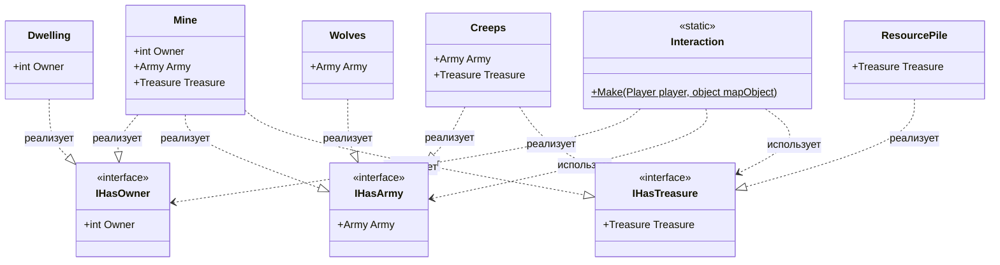

```mermaid
classDiagram
    class IHasOwner {
        <<interface>>
        +int Owner
    }

    class IHasArmy {
        <<interface>>
        +Army Army
    }

    class IHasTreasure {
        <<interface>>
        +Treasure Treasure
    }

    class Dwelling {
        +int Owner
    }

    class Mine {
        +int Owner
        +Army Army
        +Treasure Treasure
    }

    class Creeps {
        +Army Army
        +Treasure Treasure
    }

    class Wolves {
        +Army Army
    }

    class ResourcePile {
        +Treasure Treasure
    }

    class Interaction {
        <<static>>
        +Make(Player player, object mapObject)$
    }

    Dwelling ..|> IHasOwner : реализует
    Mine ..|> IHasOwner : реализует
    Mine ..|> IHasArmy : реализует
    Mine ..|> IHasTreasure : реализует
    Creeps ..|> IHasArmy : реализует
    Creeps ..|> IHasTreasure : реализует
    Wolves ..|> IHasArmy : реализует
    ResourcePile ..|> IHasTreasure : реализует

    Interaction ..> IHasOwner : использует
    Interaction ..> IHasArmy : использует
    Interaction ..> IHasTreasure : использует
```
