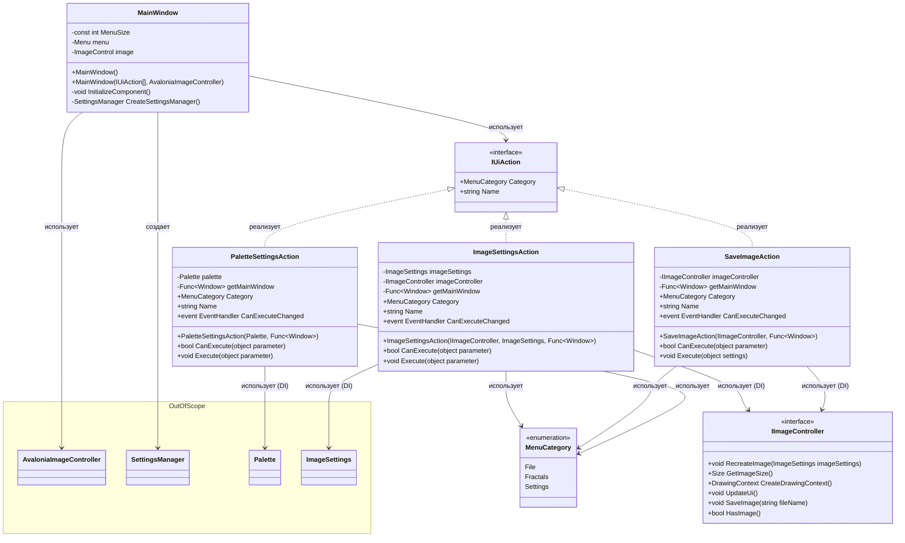

```mermaid
classDiagram
    class IUiAction {
        <<interface>>
        +MenuCategory Category
        +string Name
    }

    class MenuCategory {
        <<enumeration>>
        File
        Fractals
        Settings
    }

    class IImageController {
        <<interface>>
        +void RecreateImage(ImageSettings imageSettings)
        +Size GetImageSize()
        +DrawingContext CreateDrawingContext()
        +void UpdateUi()
        +void SaveImage(string fileName)
        +bool HasImage()
    }

    class ImageSettingsAction {
        -ImageSettings imageSettings
        -IImageController imageController
        -Func~Window~ getMainWindow
        +MenuCategory Category
        +string Name
        +event EventHandler CanExecuteChanged
        +ImageSettingsAction(IImageController, ImageSettings, Func~Window~)
        +bool CanExecute(object parameter)
        +void Execute(object parameter)
    }

    class SaveImageAction {
        -IImageController imageController
        -Func~Window~ getMainWindow
        +MenuCategory Category
        +string Name
        +event EventHandler CanExecuteChanged
        +SaveImageAction(IImageController, Func~Window~)
        +bool CanExecute(object parameter)
        +void Execute(object settings)
    }

    class PaletteSettingsAction {
        -Palette palette
        -Func~Window~ getMainWindow
        +MenuCategory Category
        +string Name
        +event EventHandler CanExecuteChanged
        +PaletteSettingsAction(Palette, Func~Window~)
        +bool CanExecute(object parameter)
        +void Execute(object parameter)
    }

    class MainWindow {
        -const int MenuSize
        -Menu menu
        -ImageControl image
        +MainWindow()
        +MainWindow(IUiAction[], AvaloniaImageController)
        -void InitializeComponent()
        -SettingsManager CreateSettingsManager()
    }

    namespace OutOfScope {
        class AvaloniaImageController {}
        class SettingsManager {}
        class Palette {}
        class ImageSettings {}
    }

    IUiAction <|.. ImageSettingsAction : реализует
    IUiAction <|.. SaveImageAction : реализует
    IUiAction <|.. PaletteSettingsAction : реализует

    ImageSettingsAction --> IImageController : использует (DI)
    ImageSettingsAction --> MenuCategory : использует
    ImageSettingsAction --> ImageSettings : использует (DI)

    SaveImageAction --> IImageController : использует (DI)
    SaveImageAction --> MenuCategory : использует

    PaletteSettingsAction --> MenuCategory : использует
    PaletteSettingsAction --> Palette : использует (DI)

    MainWindow --> IUiAction : использует
    MainWindow --> AvaloniaImageController : использует
    MainWindow --> SettingsManager : создает
```
