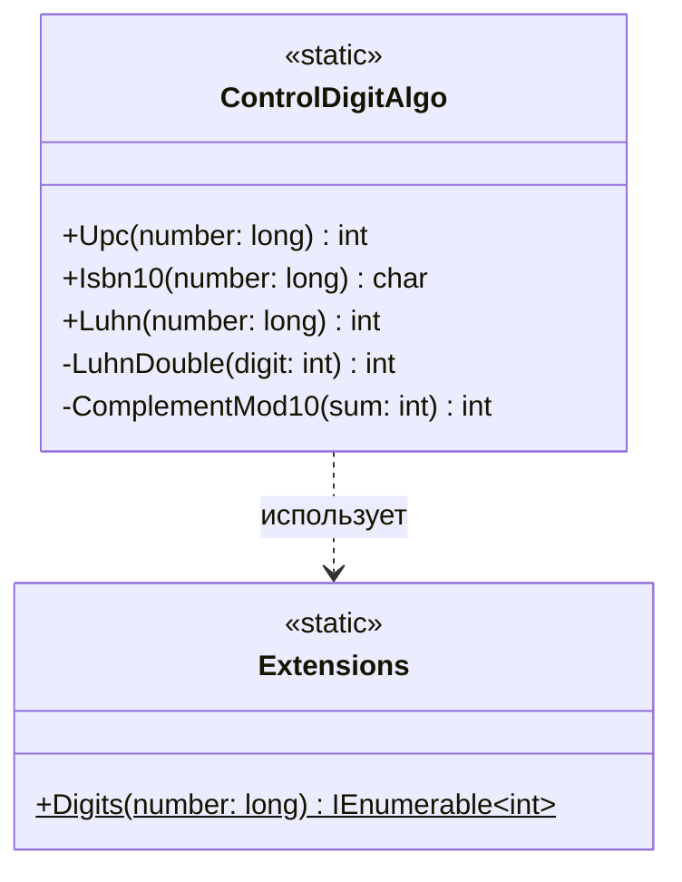

```mermaid
classDiagram
    class Extensions {
        <<static>>
        +Digits(number: long)$   IEnumerable~int~
    }

    class ControlDigitAlgo {
        <<static>>
        +Upc(number: long) int
        +Isbn10(number: long) char
        +Luhn(number: long) int
        -LuhnDouble(digit: int) int
        -ComplementMod10(sum: int) int
    }

    ControlDigitAlgo ..> Extensions : использует
```
