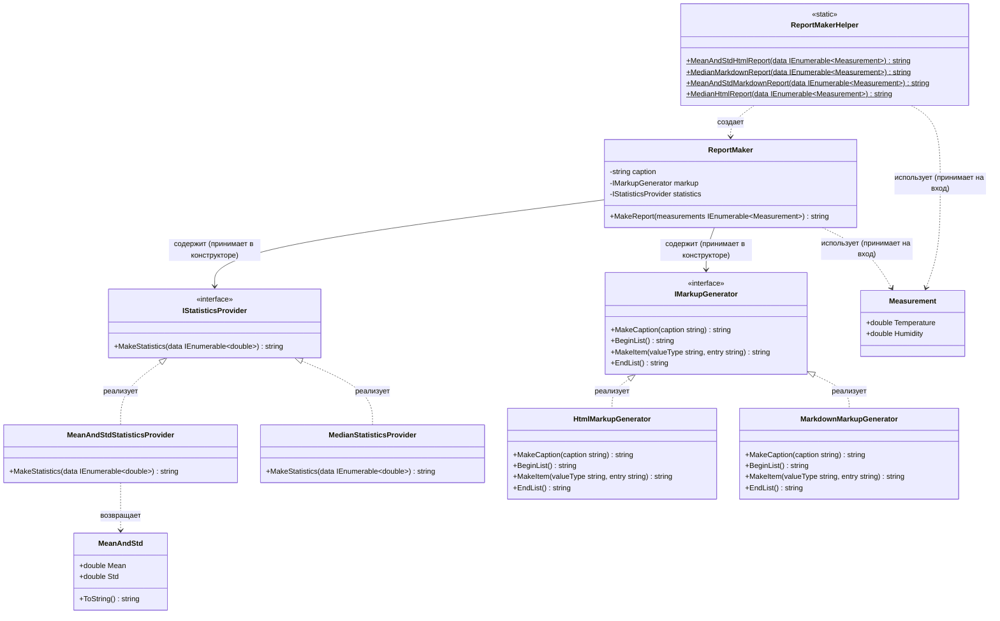

```mermaid
classDiagram
    class IStatisticsProvider {
        <<interface>>
        +MakeStatistics(data IEnumerable~double~) string
    }

    class IMarkupGenerator {
        <<interface>>
        +MakeCaption(caption string) string
        +BeginList() string
        +MakeItem(valueType string, entry string) string
        +EndList() string
    }

    class ReportMaker {
        -string caption
        -IMarkupGenerator markup
        -IStatisticsProvider statistics
        +MakeReport(measurements IEnumerable~Measurement~) string
    }

    class MeanAndStdStatisticsProvider {
        +MakeStatistics(data IEnumerable~double~) string
    }

    class MedianStatisticsProvider {
        +MakeStatistics(data IEnumerable~double~) string
    }

    class HtmlMarkupGenerator {
        +MakeCaption(caption string) string
        +BeginList() string
        +MakeItem(valueType string, entry string) string
        +EndList() string
    }

    class MarkdownMarkupGenerator {
        +MakeCaption(caption string) string
        +BeginList() string
        +MakeItem(valueType string, entry string) string
        +EndList() string
    }

    class ReportMakerHelper {
        <<static>>
        +MeanAndStdHtmlReport(data IEnumerable~Measurement~)$ string
        +MedianMarkdownReport(data IEnumerable~Measurement~)$ string
        +MeanAndStdMarkdownReport(data IEnumerable~Measurement~)$ string
        +MedianHtmlReport(data IEnumerable~Measurement~)$ string
    }

    class Measurement {
        +double Temperature
        +double Humidity
    }

    class MeanAndStd {
        +double Mean
        +double Std
        +ToString() string
    }

    IStatisticsProvider <|.. MeanAndStdStatisticsProvider : реализует
    IStatisticsProvider <|.. MedianStatisticsProvider : реализует
    IMarkupGenerator <|.. HtmlMarkupGenerator : реализует
    IMarkupGenerator <|.. MarkdownMarkupGenerator : реализует

    ReportMaker --> IMarkupGenerator : содержит (принимает в конструкторе)
    ReportMaker --> IStatisticsProvider : содержит (принимает в конструкторе)
    ReportMaker ..> Measurement : использует (принимает на вход)

    MeanAndStdStatisticsProvider ..> MeanAndStd : возвращает

    ReportMakerHelper ..> ReportMaker : создает
    ReportMakerHelper ..> Measurement : использует (принимает на вход)
```
