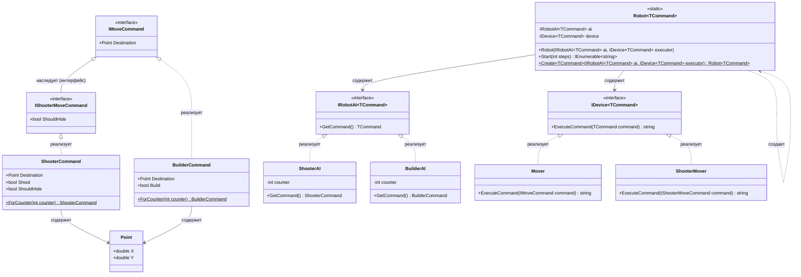

```mermaid
classDiagram
    class Point {
        +double X
        +double Y
    }

    class IMoveCommand {
        <<interface>>
        +Point Destination
    }

    class IShooterMoveCommand {
        <<interface>>
        +bool ShouldHide
    }

    class ShooterCommand {
        +Point Destination
        +bool Shoot
        +bool ShouldHide
        +ForCounter(int counter)$ ShooterCommand
    }

    class BuilderCommand {
        +Point Destination
        +bool Build
        +ForCounter(int counter)$ BuilderCommand
    }

    IMoveCommand <|-- IShooterMoveCommand : наследует (интерфейс)
    IShooterMoveCommand <|.. ShooterCommand : реализует
    IMoveCommand <|.. BuilderCommand : реализует
    ShooterCommand --> Point : содержит
    BuilderCommand --> Point : содержит

    class IRobotAI~TCommand~ {
        <<interface>>
        +GetCommand() TCommand
    }

    class ShooterAI {
        -int counter
        +GetCommand() ShooterCommand
    }

    class BuilderAI {
        -int counter
        +GetCommand() BuilderCommand
    }

    class IDevice~TCommand~ {
        <<interface>>
        +ExecuteCommand(TCommand command) string
    }

    class Mover {
        +ExecuteCommand(IMoveCommand command) string
    }

    class ShooterMover {
        +ExecuteCommand(IShooterMoveCommand command) string
    }

    class Robot~TCommand~ {
        -IRobotAI~TCommand~ ai
        -IDevice~TCommand~ device
        +Robot(IRobotAI~TCommand~ ai, IDevice~TCommand~ executor)
        +Start(int steps) IEnumerable~string~
    }

    class Robot {
        <<static>>
        +Create~TCommand~(IRobotAI~TCommand~ ai, IDevice~TCommand~ executor)$ Robot~TCommand~
    }

    IRobotAI~TCommand~ <|.. ShooterAI : реализует
    IRobotAI~TCommand~ <|.. BuilderAI : реализует
    IDevice~TCommand~ <|.. Mover : реализует
    IDevice~TCommand~ <|.. ShooterMover : реализует
    Robot~TCommand~ --> IRobotAI~TCommand~ : содержит
    Robot~TCommand~ --> IDevice~TCommand~ : содержит
    Robot ..> Robot~TCommand~ : создает
```
