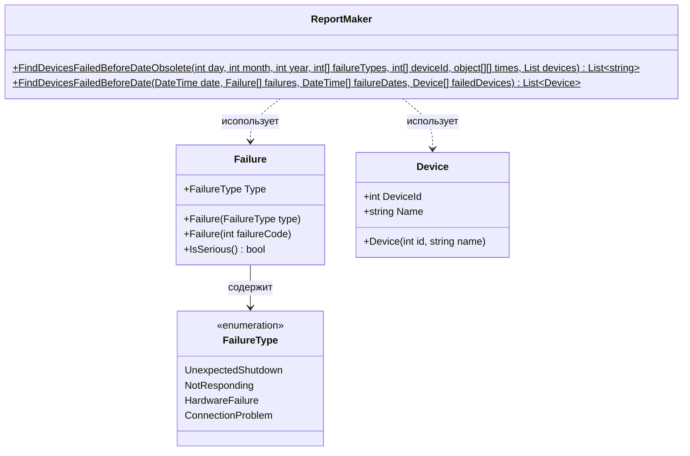

```mermaid
classDiagram
    class FailureType {
        <<enumeration>>
        UnexpectedShutdown
        NotResponding
        HardwareFailure
        ConnectionProblem
    }

    class Failure {
        +FailureType Type
        +Failure(FailureType type)
        +Failure(int failureCode)
        +IsSerious() bool
    }

    class Device {
        +int DeviceId
        +string Name
        +Device(int id, string name)
    }

    class ReportMaker {
        +FindDevicesFailedBeforeDateObsolete(int day, int month, int year, int[] failureTypes, int[] deviceId, object[][] times, List devices)$ List~string~
        +FindDevicesFailedBeforeDate(DateTime date, Failure[] failures, DateTime[] failureDates, Device[] failedDevices)$ List~Device~
    }

    Failure --> FailureType : содержит
    ReportMaker ..> Failure : исопользует
    ReportMaker ..> Device : использует
```
