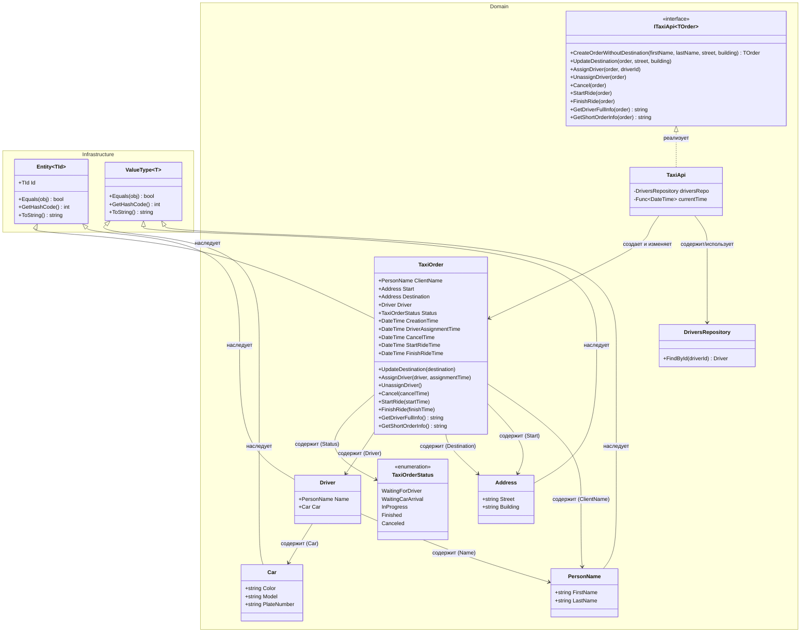

```mermaid
classDiagram
    namespace Infrastructure {
        class `Entity~TId~` {
            +TId Id
            +Equals(obj) bool
            +GetHashCode() int
            +ToString() string
        }
        class `ValueType~T~` {
            +Equals(obj) bool
            +GetHashCode() int
            +ToString() string
        }
    }

    namespace Domain {
        class PersonName {
            +string FirstName
            +string LastName
        }
        class Address {
            +string Street
            +string Building
        }
        class Car {
            +string Color
            +string Model
            +string PlateNumber
        }

        class Driver {
            +PersonName Name
            +Car Car
        }
        class TaxiOrder {
            +PersonName ClientName
            +Address Start
            +Address Destination
            +Driver Driver
            +TaxiOrderStatus Status
            +DateTime CreationTime
            +DateTime DriverAssignmentTime
            +DateTime CancelTime
            +DateTime StartRideTime
            +DateTime FinishRideTime
            +UpdateDestination(destination)
            +AssignDriver(driver, assignmentTime)
            +UnassignDriver()
            +Cancel(cancelTime)
            +StartRide(startTime)
            +FinishRide(finishTime)
            +GetDriverFullInfo() string
            +GetShortOrderInfo() string
        }
        class TaxiOrderStatus {
            <<enumeration>>
            WaitingForDriver
            WaitingCarArrival
            InProgress
            Finished
            Canceled
        }

        class ITaxiApi~TOrder~ {
            <<interface>>
            +CreateOrderWithoutDestination(firstName, lastName, street, building) TOrder
            +UpdateDestination(order, street, building)
            +AssignDriver(order, driverId)
            +UnassignDriver(order)
            +Cancel(order)
            +StartRide(order)
            +FinishRide(order)
            +GetDriverFullInfo(order) string
            +GetShortOrderInfo(order) string
        }
        class TaxiApi {
            -DriversRepository driversRepo
            -Func~DateTime~ currentTime
        }
        class DriversRepository {
            +FindById(driverId) Driver
        }
    }

    `Entity~TId~` <|-- Driver : наследует
    `Entity~TId~` <|-- TaxiOrder : наследует
    `ValueType~T~` <|-- PersonName : наследует
    `ValueType~T~` <|-- Address : наследует
    `ValueType~T~` <|-- Car : наследует
    `ITaxiApi~TOrder~` <|.. TaxiApi : реализует

    TaxiOrder --> PersonName : содержит (ClientName)
    TaxiOrder --> Address : содержит (Start)
    TaxiOrder --> Address : содержит (Destination)
    TaxiOrder --> Driver : содержит (Driver)
    TaxiOrder --> TaxiOrderStatus : содержит (Status)
    Driver --> PersonName : содержит (Name)
    Driver --> Car : содержит (Car)
    TaxiApi --> DriversRepository : содержит/использует
    TaxiApi --> TaxiOrder : создает и изменяет
```
